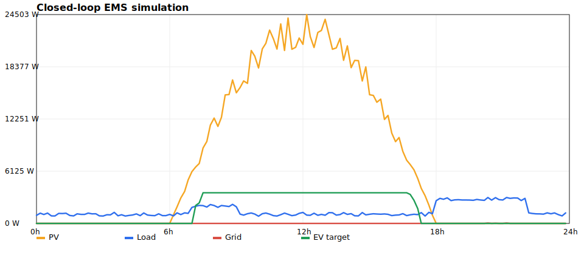

# Closed-loop EMS Simulation Report

## Summary

- Steps simulated: `144`
- Approximate PV energy: `175.78 kWh`
- Approximate load energy: `34.98 kWh`
- Approximate grid import: `0.07 kWh`
- Final battery SoC: `60.48%`
- Flexible-load commands: `{'hold': 82, 'enable': 62}`
- EV-charger commands: `{'hold': 84, 'enable': 60}`

## Controller Modes

- `normal`: 82 steps
- `self_consumption`: 2 steps
- `solar_surplus`: 60 steps

## Plot

## Interpretation

The rule-based EMS enables flexible load and EV charging during strong solar surplus, keeps commands neutral during ordinary operation, and remains structured for later hardware mapping through MQTT/Home Assistant. This report is generated from simulated data and should be repeated with real Sungrow/Home Assistant telemetry after hardware configuration details are available.
